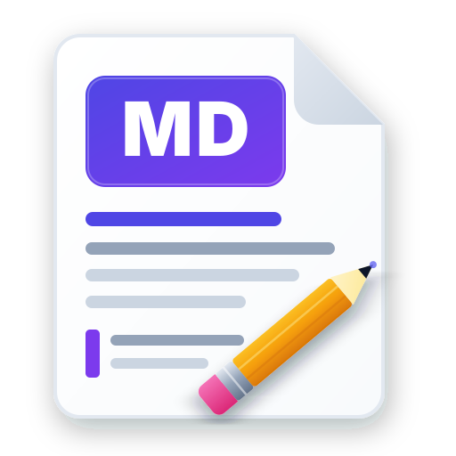

# 📝 MD-Editor

> Um editor de Markdown moderno, intuitivo e com integração Git nativa, disponível para Desktop (Electron) e Web.



---

## 🌟 Visão Geral

O **MD-Editor** foi desenvolvido para oferecer a melhor experiência na criação, edição e organização de documentações em Markdown. Compatível com workflows baseados em repositórios Git, ele simplifica o salvamento automático, upload de arquivos de mídia e visualização em tempo real de diagramas e fórmulas matemáticas.

---

## ✨ Funcionalidades Principais

- ⚡ **Preview em Tempo Real:** Edição com divisão de tela e renderização instantânea do Markdown.
- 🐙 **Integração Git Integrada:**
  - Clonagem direta de repositórios remotos (suporte a autenticação por Token e branches).
  - Sincronização em um clique: *Commit*, *Pull* e *Push* automatizados.
- 🖼️ **Gerenciador de Mídias:**
  - Arraste ou envie imagens (`imgs/`), vídeos (`videos/`) e anexos (`arquivos/`).
  - Organização automática na pasta do seu projeto local.
- 📊 **Diagramas e Fórmulas:** Suporte nativo a **Mermaid.js** (fluxogramas, gráficos) e **KaTeX** (expressões matemáticas).
- 🗂️ **Navegador de Arquivos do Workspace:** Árvore de arquivos completa para criar, renomear e excluir notas e pastas.
- 💻 **Plataforma Dupla:** Funciona como aplicativo Desktop nativo (Electron) ou aplicação Web no navegador.

---

## 📥 Como Baixar a Versão Compilada no GitHub

Você não precisa compilar o código fonte para utilizar o aplicativo! O GitHub gera uma nova versão compilar a cada código enviado.

### Opção 1: Baixar via GitHub Actions (Versão mais recente de cada push)

1. Acesse o repositório do projeto no **GitHub**.
2. Clique na aba **Actions** na barra superior.
3. Clique no workflow mais recente da lista (com o ícone verde de sucesso `✓`).
4. Role até o final da página até a seção **Artifacts**.
5. Clique em **`MD-Editor-Win-x64`** para baixar o arquivo `.zip` contendo a versão executável para Windows.
6. Extraia o conteúdo e execute o arquivo `MD-Editor.exe`.

---

## 🛠️ Como Baixar e Compilar Localmente

Se você deseja contribuir com o código fonte ou gerar sua própria compilação localmente, siga as instruções abaixo:

### 📋 Pré-requisitos

Certifique-se de ter instalado em sua máquina:
- **[Node.js](https://nodejs.org/)** (v18 ou superior)
- **[Git](https://git-scm.com/)**

---

### 1. Clonar o Repositório

```bash
git clone https://github.com/SEU-USUARIO/md-editor.git
cd md-editor
```

---

### 2. Instalar as Dependências

Instale as dependências do backend, Electron e frontend com um único comando:

```bash
npm run install:all
```

---

### 3. Executar em Modo de Desenvolvimento

Para rodar a aplicação localmente com suporte a *Hot Reload*:

```bash
# Inicia o servidor backend e o servidor frontend (Vite)
npm run dev

# Em outro terminal (opcional), para abrir a janela do Electron:
npm run start:electron
```

---

### 4. Compilar o Aplicativo (Gerar o Executável `.exe`)

Para gerar a versão executável da aplicação Desktop para Windows:

```bash
npm run dist:electron
```

O executável final será gerado dentro da pasta:
```
dist-app/MD-Editor-win32-x64/MD-Editor.exe
```

---

## 🤖 Compilação Automática no GitHub (CI/CD)

O repositório conta com um fluxo automatizado do **GitHub Actions** ([.github/workflows/build.yml](file:///.github/workflows/build.yml)).

Sempre que um novo código for enviado (`git push` na branch `main` ou `master`), o GitHub irá automaticamente:
1. Configurar o ambiente Windows.
2. Instalar o Node.js e todas as dependências do projeto.
3. Executar o build do frontend e empacotar o aplicativo Electron.
4. Disponibilizar o artefato compilado pronto para uso na aba **Actions**.

---

## 🤝 Contribuição

Contribuições são super vindas! Fique à vontade para abrir uma *Issue* ou enviar um *Pull Request*:

1. Faça um Fork do projeto
2. Crie uma branch para sua funcionalidade (`git checkout -b feature/minha-funcionalidade`)
3. Faça o commit das suas alterações (`git commit -m 'feat: Adiciona minha funcionalidade'`)
4. Envie para a branch (`git push origin feature/minha-funcionalidade`)
5. Abra um Pull Request

---

## 📄 Licença

Este projeto está sob a licença [MIT](LICENSE).
